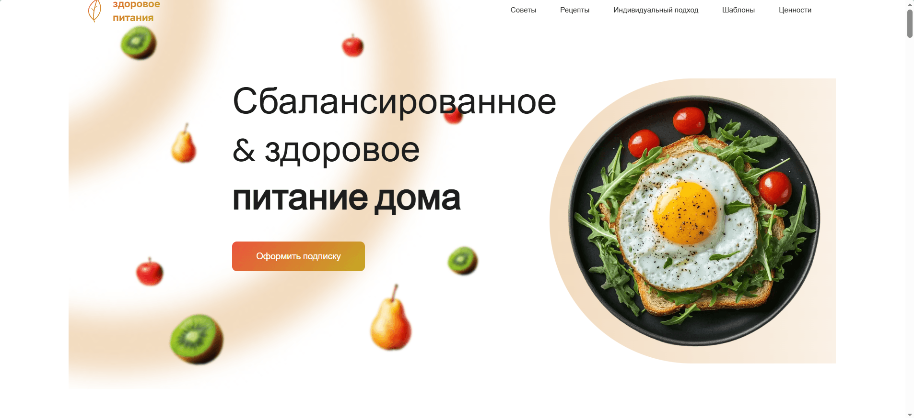
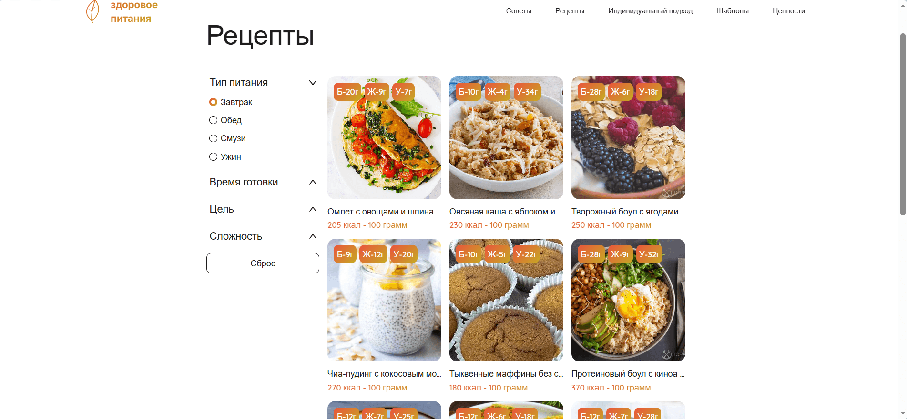

# Healthy Food — Правильное питание на Next.js

Адаптивный каталог с полезными рецептами с фильтрами и пагинацией .

## Демо

**Сайт:** https://healthy-food-vert.vercel.app/

## Стек

- **Frontend:** Next.js 14, TypeScript
- **Стилизация:** SCSS (БЭМ)

## Функционал

- Каталог рецептов с пагинацией
- Фильтры по типу, времени готовки, цели и сложности
- Адаптивная верстка (computer-first)
- Оптимизация изображений через Next.js Image

## Демонстрация интерфейса

**Главная страница**

**Каталог рецептов**

**Рецепт**

